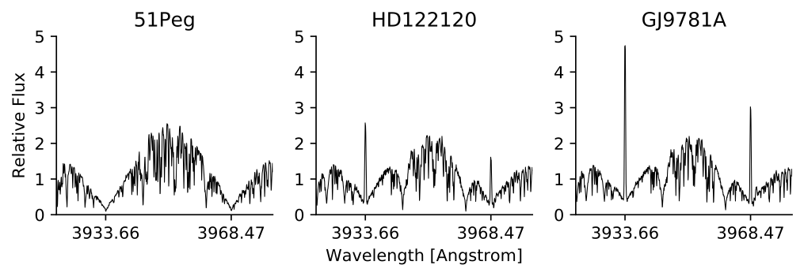
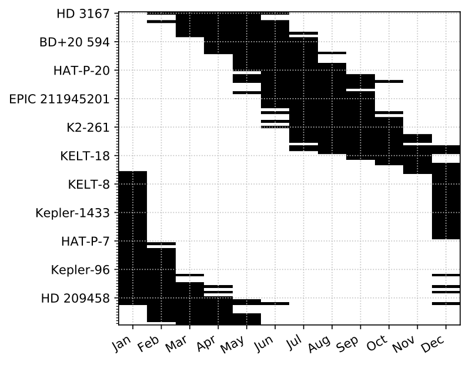
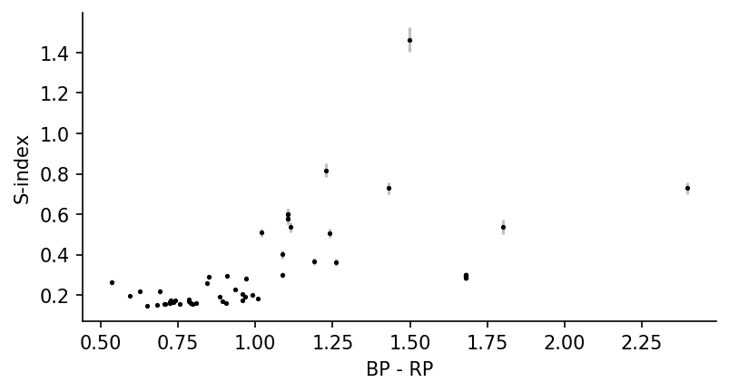
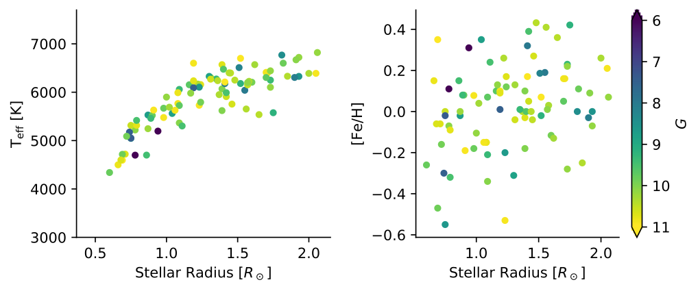

Background
==========

   Some example APO/ARCES spectra from our APO catalog of Ca II H & K emission line stars. The emission at the center of the calcium H & K lines is proportional to the amount of chromospheric activity, which is correlated with the phase of the stellar activity cycle.

Two of the enduring questions of stellar astrophysics are: *is the Sun a
typical G star*, and *what is the range of magnetic activity that
Sun-like stars exhibit*? Magnetic activity on the surfaces of stars like
the Sun manifests as dark spots, where strong magnetic fields locally
inhibit convection, cooling roughly planet-sized regions in the solar
photosphere (Solanki 2003). While they are dark in
broad optical bandpasses, they emit excess flux compared to the mean
solar photosphere in certain emission lines, like the Fraunhofer lines
such as CaII H & K lines (Hall 2008). The
presence of these magnetic active regions can have a wide variety of
implications. The Sun is a dominant source of forcing on the Earth’s
climate, and small changes in the solar SED can have measurable affects
on the Earth’s climate (Solanki 2013). Thinking
farther from home, observations of exoplanets orbiting solar-type stars
are strongly affected by the presence of starspots: correct exoplanet
radii and atmospheric compositions can be only deduced if the effect of
starspots is mitigated (Morris2017a, Morris2018b).

Over the span of three decades, a treasure trove of spectroscopic
observations of nearby solar-type stars was collected by Olin C. Wilson
(Wilson 1957, 1963, 1964, 1968, 1970, 1976, 1978).
Several important discoveries were made as a result of this work.
Perhaps most famously, Skumanich (1972) published a
relationship between stellar age/rotation and chromospheric activity
emission indices of stars in the CaII H & K emission lines of
main-sequence solar-type stars based on Wilson’s observations. This is
one of the seminal works which empirically established that stellar
activity declines with age, spawning much interest in: (1) rotation as
the foremost driver of stellar magnetic dynamos; and (2) Ca emission as
a diagnostic indicator of the phase and strength stellar activity
cycles. Further observations combined with archival data mining by
Baliunas (1995) revealed the diversity of stellar
activity cycle morphologies which vary as a function of stellar age and
mass. Stars like the Sun have periodic :math:`\sim 11` year activity
cycles, whereas young solar analogs can have chaotic, non-periodic
“cycles”. Much work has been done to calibrate equivalent H & K
measurements of the Sun in order to place the Sun in the stellar context
(Egeland 2017).

In the coming decade, optical, ground-based observations of solar-type
stars which establish the phase and strength of stellar activity cycles
will be critical for understanding how stellar activity influences
observations of exoplanet host stars at optical wavelengths. NASA’s TESS
mission is discovering a plethora of planets orbiting solar-type stars
at a variety of ages, like V1298 Tau (K0V, 23 Myr) and DS Tuc (G6V, 45
Myr) (David 2019, Newton 2019). These younger stars are
the keys to determining how planetary radii evolve with age as
atmospheres cool and shrink (Fulton 2017); but these
younger stars are also far more active than the Sun, and we can expect
their starspots to contaminate spectroscopic and photometric follow-up
of these compelling targets. Fortunately, JWST observations will not be
strongly contaminated by stellar activity (Zellem 2017); but any complementary TESS, HST, CHEOPS
and eventually PLATO observations can reach sensitivity regimes where
the effects of stellar activity on the radii and transmission
spectroscopy measurements of these stars can become significant.

The stellar activity cycles of the planet-hosting stars may vary from
periods of :math:`\sim 1-10` years, and we can only know the phase and
strength of the stellar activity cycles for planet-hosting stars if we
measure them a few times a year with high resolution spectroscopy. APO
is uniquely suited to take these activity observations – the ARC 3.5 m
Telescope can efficiently collect high S/N spectra of nearby, bright
solar analogs for fast activity index measurements over the next decade.
**A time-series database of CaII H & K measurements will be a touchstone
refernece for exoplaneteers to determine the extent of contamination by
stellar activity in their exoplanet observations, as well as a modern
update to the Baliunas (1995) sample which reveals how
the magnetic activity of exoplanet host stars varies with spectral type,
planet orbital period, etc.**

   Visibility of 110 targets in our catalog – each row corresponds to the visibility of a single target, black pixels are when the target is not visible, white pixels are when the target is visible. You can see that there are targets observable for every month of the year, with the over-density of Kepler targets yielding a block of summer targets.

In Morris (2019b), we observed solar-type stars with
the ARCES echelle spectrograph to measure CaII H & K activity, see
Figure \ `1 <#fig:spectra>`__. We calibrated the ARCES instrument
against the Mount Wilson Observatory’s catalog of observations by
Duncan (1991), enabling us to measure the :math:`S`
indices of any star observable with APO/ARCES.

In this program, **we will go beyond the set of stars original
observed by Morris (2019b) to create a legacy survey
of exoplanet-host star H & K measurements going into the distant future
with APO/ARCES, which we call the Olin Wilson Legacy Survey (OWLS).** We
have already developed a Python package for reducing the spectroscopy
from the ARCES instrument called `aesop <https://github.com/bmorris3/aesop>`_
which is modular and easily adopted by new
students (Morris 2018), and we have already
calibrated the ARCES instrument to produce :math:`S`-index measurements
(Morris 2017b, Morris 2019b). All that remains to do is
to collect spectra of as many targets as possible over as long a time
baseline as possible. All :math:`S`-indices measured by OWLS will be
immediately released online for use by astronomers characterizing the
exoplanets of our host stars, all over the world. We plan for a data
release announcement to occur once per year, led by a graduate student
at the University of Washington.

Status Update for 2021
----------------------

With the first year of OWLS observations logged in 2020, we are pleased
to report that we have successfully measured the :math:`S`-indices of 50
FGK stars with ARCES. We have reduced the observations and confirmed
that we are measuring the flux in the CaII H & K cores with sufficient
S/N to measure precise :math:`S`-indices useful for chromospheric
activity monitoring. A sampling of observations of :math:`S`-indices
with (very small uncertainties) are shown in Figure \ `2 <#fig:sind>`__.

   Calibrated :math:`S`-indices for 50 OWLS targets obtained in the year 2020.

.. table:: A fraction of the 110 targets in the OWLS catalog, which we plan to observe throughout the upcoming years, with the exposure times required to reach a S/N=25 at the CaII H & K lines.

   ========= ====== ============ ============ ========
   Name      G      RA           Dec          Exposure
   \                                          [min]
   HD 3167   8.762  00h34m57.52s +04d22m53.3s 5
   WASP-93   10.978 00h37m50.11s +51d17m19.5s 35
   HAT-P-16  10.757 00h38m17.56s +42d27m47.1s 29
   K2-209    10.745 00h58m45.76s +01d23m01.7s 28
   K2-222    9.361  01h05m50.95s +11d45m12.3s 8
   WASP-118  10.92  01h18m12.13s +02d42m10.2s 33
   WASP-76   9.395  01h46m31.86s +02d42m01.9s 8
   WASP-77 A 10.097 02h28m37.23s -07d03m38.5s 16
   HD 17156  8.033  02h49m44.49s +71d45m11.6s 2
   K2-175    10.625 03h30m00.86s +17d35m03.1s 25
   ⋮         ⋮      ⋮            ⋮            ⋮
   ========= ====== ============ ============ ========

   OWLS planet-hosting target spectroscopic properties. All stars have
   radii and effective temperatures consistent with single,
   main-sequence host stars with near-solar metallicity.

